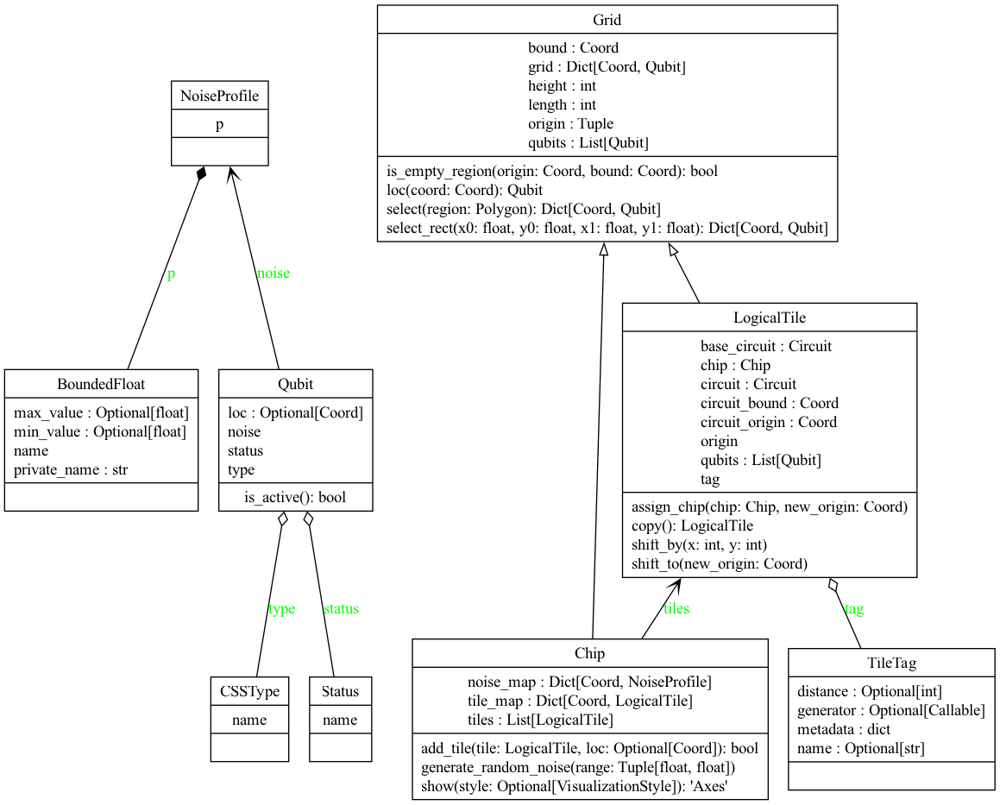

# qSNOW

qSNOW (STIM Noise Orchestration Workflow) is designed to provide a way to orchestrate multiple logicals across a grid/chip of qubits.

See the [demo notebook](demo.ipynb) for a overview of tool.

### Class Overview

