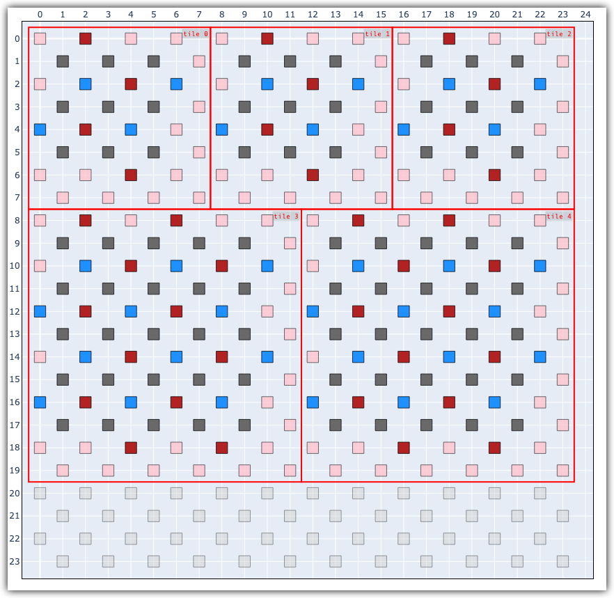

# qSNOW

## Project Overview
qSNOW (quantum Simulated Noise Orchestration Workflow) is designed to provide a way to orchestrate manipulating and simulating performance of multiple logicals across a grid/chip of qubits. Different qubit architechture vary in exhibited noise model, thus qSNOW allows for mapping granular noise models to chip-wide experiments.

qSNOW create tiles by ingesting STIM circuits, mapping the circuit-level qubits to the underlying qubits on the chip, and uniquely injecting noise into the circuit via sets of customizable noise injection rules. These injection rules conditionally trigger noise channels on individual qubits based on conditions or operations occuring in each circuit. 

qSNOW is, at it's heart, meant to be used as an extendable toolbox for supporting simulation efforts on any variety of QEC codes by providing extendable base classes that can be made code-specific with minimal implementation overhead. As 

## Workflow
The fundamental workflow of qSNOW is to place logical tiles on a abstract chip, like such:

```python
from qsnow.interface import Chip, SCTile

## Create chips and tiles
chip = Chip(12, 12)

d3Tile = SCTile(distance=3)
d5Tile = SCTile(distance=5)

## Specify any arbitrary noise model
chip.generate_gaussian_noise(mean=0.001,deviation=0.0006)

## Place logical tiles on the chip
chip.add_tile(d3Tile,       loc=(0,0))
chip.add_tile(d3Tile.copy(),loc=(8,0))
chip.add_tile(d3Tile.copy(),loc=(16,0))

chip.add_tile(d5Tile,       loc=(0,8))
chip.add_tile(d5Tile.copy(),loc=(12,8))

## Visualize the chip layout
chip.show(css_style)
```


See the [demo notebook](demo.ipynb) for a full overview of tool.

## Installation
The package is intended for wider distribution at some point, but can be installed locally. If your interested in using the tool, I'd personally recommend creating a python env (i.e., conda, venv, etc.) and installing it as a local development package, like such:

```bash
conda create --name qSNOW python=3.14
conda activate qSNOW
pip install -e .
```

This installs the current build as a local package such that it can be used as would any other PyPi package:

```python

```


